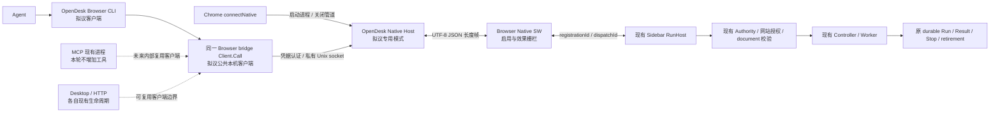

# OpenDesk 接管 Browser 本机通信：兼容设计 R1

日期：2026-10-09（Asia/Shanghai）。状态：`DESIGN_ONLY / IMPLEMENTATION_GATE_NOT_MET`。

本轮只读核对两个产品仓库，并在独立文档 worktree 保存方案。没有实现或切换 OpenDesk Host，没有运行测试、构建、Chrome、安装、更新或清理命令。本文全部 `opendesk browser …` 命令、Go 文件和迁移状态机均为**拟议**，当前不可执行。输入身份和证据索引见 [本轮工作流](../../framework/workstreams/opendesk-native-takeover-01a1200a.json)。

## 1. 决策与阶段门槛

推荐让 OpenDesk 的同一个可执行程序提供独立 `browser native-host` 与 `browser` 客户端子命令，复用一个本机通信包。Native Host 由 Chrome 启动和拥有连接；CLI 只连接该 Host 的私有 Unix socket。二者不依赖 Desktop 窗口、Desktop 单实例、常驻 HTTP 或 MCP 服务。内部传输用 Go 实现，不把 Node 子进程包装成已经接管。

两个工程尚未上线，允许重构内部模块，并在接管验收后退役 Node 运行依赖；这不取消本轮明确的基线门槛，也不授权提前删除 Node 源码、原始证据或改变外部六接口合同。保留协议、路径、凭据和 Browser 权限语义，避免一次迁移同时改变所有身份。

最新 R6.5 的旧包已有六接口局部成功：现代 draft 终态 completed、Stop 终态 stopped，都有 released；自动 Native smoke 曾 FAIL，后续受控连接证据不抹去该失败。最终候选早期doctor为connected:false；后续 `native-final/doctor-authenticated-ready.json` 已为connected:true，当时hostRegistrations为空。更晚的 `final-modern-visible-durable-response.json` 已证明最终包draft completed/retirementState released；保留这一局部native成功，不能写成最终包完全未运行。仍未见最终身份上的saved/Stop、运行期间revision pin/document变化/撤权、ACK丢失、断线去重、标准43111与43119变体、同profile完整重启的闭合证据。不能把旧包成功提升为最终包全部验收。**本轮实施门槛未满足，因此交付兼容设计，源码接管和真实迁移留待基线完成。** 旧架构文档中的 PR #11 Draft/未合并描述不能覆盖最新已合并记录。

R6.5 负责人 `01a11fbc-70f8-7f32-8201-b347406d8bdc` 的工作流为 IN_PROGRESS；R6.2 续接负责人 `01a11ff2-e603-75f3-bfc8-c93545657348` 的工作流为 READ_ONLY_BRANCH_COMPLETE_NATIVE_ACCEPTANCE_PENDING_PARALLEL_R65。旧 native packageHash 为 `63b090e3727dd3eb056e6bfc21297bc4c5eced83bdf9ee75de1c9fca762f0e0a`；R6.5 最终 source 为 `fdcec121c15a2e2519f10229a0092eb720c564ce`，packageHash 为 `f2595de0d873be1d623763cfc1f13c1fb66e6aeccaea2c2a6c7c982dab046d83`。这些身份不是本轮设计worktree的SHA，亦不含共享main之后的全部dirty输入。

基线重新核对后的最小实施入口是：Node 负责人确认同一候选的安装/Host/CLI 输入身份，六接口正常链路及相关异常语义有原始证据，资源已释放或明确交接。R6.2 中 Task 发布/安装属于 Browser 原职责，不要求本机迁移再造或替代它；原框架 603＋19、B05、campaigns、F3、ZIP 的正式门槛独立保留，不能凭 Host 接管关闭。

本轮只读安装观察：CFT 的 manifest 指向 `~/.opendesk-browser/native-agent-r1/native-host`，该启动器使用 Node；`agent.sock` 不存在。未连接 Host，也未判定该旧 extensionId 在任何当前 Chrome session 中有效。`DEFAULT_PROVIDER=NODE` 仅表示源码与安装启动器未切换，不表示 Node 当前在线或已经完成验收。

### 文档合入与后续实施

设计文档可以先通过独立PR合入main，不要求先完成Node全部验收；源码接管和默认provider切换仍遵守上述门槛。合入准备时，本分支已快进同步远端main `99269e624574976d02afe3de20d9bb338f0e4b2f`，没有修改共享main现场。新增内容限定为本方案和工作流文本记录，没有运行时、权限、安装或默认入口变更。

输入/原始证据索引保留此前观察时的commit、hash和本机绝对路径，不把它们改写为最新main已验收。绝对路径是原始本机档案定位，其他机器不能直接打开；远端读者可核对索引中的仓库相对源码路径与git身份，真实验收仍需原始档案。PR中的小型文本快照放在 `docs/framework/workstreams/evidence/opendesk-native-takeover-01a1200a/`，本机忽略目录中的原记录保持不变；不提交credential、私有备份、浏览器profile、dist或ZIP。

当前main已合入RunHost released通知等变化，旧包native成功不得自动提升为这些输入上的PASS。继续推进时先读取最新Native/R6.2/R6.5记录及原始receipt，复核受影响输入和资源交接；基线形成后直接进入第3节OpenDesk最小实现切片，不重复设计或全量重跑已证明的无关行为。Browser分支只承担合同/驱动薄适配，OpenDesk实现使用其独立worktree/任务分支。

## 2. 现状与职责

| 职责 | 当前实现 | 接管后 owner | 边界 |
| --- | --- | --- | --- |
| Chrome framing / hello / welcome / stdio | `native-agent/wire.mjs`、`native-host.mjs` | OpenDesk Browser bridge 包 | 不解释或执行业务脚本 |
| 本机认证与单请求 IPC 客户端 | `native-agent/cli.mjs`、Host | OpenDesk 同一 bridge 包 | 凭据不进入网页、HTTP、环境变量或日志 |
| 用户级安装、更新、诊断、清理 | `native-agent/install.mjs` | OpenDesk Browser 安装适配 | 不复用通用 Desktop 安装器覆盖 Native 身份 |
| 在途请求关联、socket 和连接退出 | Node Host | Chrome 启动的 OpenDesk Host | 不由 Desktop 单实例或后台 daemon 保活 |
| Native 启用、网站授权、document 和 Host 选择 | `src/native-agent/service-worker.js`、`host-adapter.js` | Browser 原 owner | 桌面不得请求替代网站授权或猜测 tab |
| Authority / RunHost / Controller / Worker | Browser 原运行链 | Browser 原 owner | 不调用 OpenDesk desktop executor 执行 Browser 任务 |
| Script Revision、Task、durable Run/Result、Stop、retirement | Browser 原服务 | Browser 原 owner | 不建立新的脚本/权限/任务/结果库 |
| requestId/digest 持久效果栅栏 | Browser SW ledger v1 | Browser 原 owner | 本机仅关联在途请求，不复制持久去重库 |

拟议通信图（OpenDesk 节点未实施）：



Desktop / HTTP 的既有端点分配和 App identity 保持原职责。Browser Host 的 socket owner 是 Chrome 连接进程，不能使用 Desktop HTTP discovery、固定 60844、App 单实例激活或 script-instance 替换机制。OpenDesk `automation/Browser` 的系统浏览器打开功能、`pkg/nativeextension` 的子进程协议、MCP 逐行 JSON-RPC 均不能充当 Chrome Native Messaging。

## 3. 统一入口与最小接入

OpenDesk 当前 `cmd/opendesk/main.go` 在旧 flag 流程之前分派 `app/package/flow/license/ai`；`internal/aicli/aicli.go` 以首参数精确识别 `ai`。采用相同命令风格，拟议入口如下：

| 拟议入口 | 用途 | stdout |
| --- | --- | --- |
| `opendesk browser native-host <Chrome-origin>` | 仅由已注册启动器调用 | 仅 Native 长度帧 |
| `opendesk browser bridge.status` | 本机 Agent 六接口客户端 | 与 Node 相同 JSON response |
| `opendesk browser target.current --file request.json` | 明确或唯一 Host 的目标快照 | 同上 |
| `opendesk browser script.save --file request.json` | 原 Controller CAS 保存 | 同上 |
| `opendesk browser run.start --file request.json` | 原运行链准入 | 同上 |
| `opendesk browser run.get --file request.json` | 原持久结果投影 | 同上 |
| `opendesk browser run.stop --file request.json` | 原 Stop 入口 | 同上 |
| `opendesk browser setup --extension-id <真实ID> --browser chrome\|cft` | 受控安装 | Node 兼容安装回执 |
| `opendesk browser update --extension-id <真实ID> --browser chrome\|cft` | 保留身份和凭据的更新 | 同上 |
| `opendesk browser doctor` / `cleanup` | 诊断 / 精确 owner 清理 | Node 兼容诊断/清理回执 |

六接口继续支持 `--file`、`--request-id`；文件中的 `requestId` 不属于 params，优先级保持 CLI 参数 > 文件值 > 新 UUID。文件里没有 requestId 的一次新调用可以生成 ID，但禁止失败后自动生成新 ID 重发。命令参数解析可以沿用 CLI 结构，不能把 response 包进 AI CLI 的 `ok/command/result/evidence` envelope 或 MCP JSON-RPC envelope。MCP 只预留同一 `Client.Call` 的内部复用边界，本轮不注册新的 MCP 工具。

Chrome manifest 没有自定义命令参数字段。保持固定 manifest.path，通过私有启动器选择模式：

```sh
# 拟议；仅说明安装器生成的形状，当前不执行。
#!/bin/sh
exec '/Users/<user>/.opendesk-browser/native-agent-r1/opendesk' browser native-host "$@"
```

路径由安装器按真实 home 生成并可靠进行 shell quoting；不是 PATH 查找，不使用可变 `.app` 转发器，不通过普通 argv 中出现 `chrome-extension://` 来自动识别 Host 模式。进入明确的 `browser native-host` 模式后才校验 Chrome origin。启动器使用 `exec`，保持 Chrome 直接拥有实际 Host 进程。

同二进制有两个必须实测的风险：`main.go:init()` 在 CLI 分派前可能检查 bundled App 并锁主线程；当前可执行文件链接 robotgo/Cocoa 等原生库，main 的提前返回不能消除初始化或 C stdout。拟议 `browser` 路由必须在 bundle/App/console/flag/HTTP/Scheduler 初始化前选定；检查 import/init 闭包并用原始 stdout 验证。quiet 或重定向 Go logger 不能证明 C stdout 干净。

本方案按用户“优先评估同一可执行程序”的要求，实施与验收均以同二进制独立模式为目标。若当前原生链接确实阻止Host无窗口运行或污染stdio，保留失败原始证据，先解决初始化及stdio隔离，不自动转为独立Host构建。精简Host二进制属于本方案之外的架构取舍，需另行提供实测依据和更新后的设计；不能仍宣称同一个可执行程序已实现。不因目前只有静态风险就新建一套daemon或框架。

拟议最小代码范围（基线关闭后，在 OpenDesk 独立 worktree 实施）：

```text
OpenDesk
  internal/browsercli/command.go           精确子命令分派、文件参数、输出、退出码
  internal/browserbridge/wire.go           Native 帧及 IPC 行协议；只用标准库
  internal/browserbridge/client.go         安装凭据、单请求、145s 超时、零重试
  internal/browserbridge/host.go           hello/welcome、认证、转发、关联、资源/退出
  internal/browserbridge/install_darwin.go 安装身份、manifest、快照和迁移事务
  cmd/opendesk/main.go                     browser 路由及初始化旁路
  docs/integrations/browser/README.md      实际可执行入口与安装迁移文档（实施后）
Browser
  现有合同/测试驱动的 provider 选择缝隙    只让原驱动能比较 Node/OpenDesk
  native-agent/*.mjs                       先保留；不改默认实现、不删除
  src/native-agent/*.js                    传输接管原则上不需修改
```

不新增依赖。Go package 的单元测试可验证新传输、socket 和进程层；公开 Browser 行为仍由 Browser 现有测试驱动和真实 Chrome 入口验证，不新建第二份相似的业务用例。

## 4. Node → OpenDesk 兼容矩阵

下表的 OpenDesk 列均是待实现要求，**没有任何一项已取得跨实现 PASS**。Node 精确源码输入见本轮 snapshot；主干有并行未提交修改，不能把这些 hash 当作冻结候选或复用旧包的正式验收。

| 项目 | 当前 Node / Browser 合同 | OpenDesk 接管要求 |
| --- | --- | --- |
| Host 名称与 wire 版本 | `com.shopable.opendesk_browser.agent`；`v:1` | 完全保留；不更换成 OpenDesk 旧 demo 名称 |
| extension origin | 单个 `chrome-extension://<32位a-p ID>/`；无通配 | manifest 和运行 origin 双重匹配；不是凭据替代品 |
| manifest | `type:stdio`；绝对 `…/native-host` 路径 | 保持名称/type/path/allowed_origins；实现只换私有启动器背后的程序 |
| Native frame | 4 字节 uint32 长度，当前 macOS 小端；正文 UTF-8 JSON | 按实际字节计长、完整读写、分段/粘连帧；长度校验先于分配 |
| 应用上限 | 双向应用消息 `60 * 1024 = 61440` bytes | 不提高到 Chrome 的平台最大值；browser canonical 大小校验继续由 Browser 执行 |
| IPC frame | UTF-8 JSON + 单个 LF；有界 decoder | 保留行协议；不替换成 HTTP 或 JSON-RPC |
| stdout | Host 只输出 Native frame；诊断 stderr | 所有 Go/C 初始化、错误/退出路径都不得混入普通日志 |
| 握手 | Host `hello:{v:1,kind:'hello'}` → Browser `welcome:{v:1,kind:'welcome',extensionId,extensionVersion}` | 不增加必需字段；10s 握手超时；就绪前拒绝执行 |
| 本机认证 | IPC 首条 `{v:1,kind:'auth',credential}`；64位 hex；恒时比较 | 保留原安装 credential；3s 认证期限；不暴露为 CLI/env 参数 |
| 认证响应 | `{v:1,kind:'authenticated',browserReady}` | 同形状；未就绪 CLI 返回 `E_NATIVE_NOT_READY` |
| 一次连接 | 认证后一个 request；第二个拒绝 | 不变成隐式批处理或自动重连会话 |
| 请求 | `{v:1,kind:'request',requestId,method,params}`；ID 匹配 `[a-zA-Z0-9._:-]{1,100}` | 不改字段、ID、params 或六方法名单 |
| 响应 | `{v:1,kind:'response',requestId,result}` 或 `error`，二者恰一 | 正常回包原样转发；不可给浏览器 response 再套本机 envelope |
| Host 选择 | 未登记 `E_HOST_NOT_READY`；多 Host 无明确选择 `E_HOST_AMBIGUOUS` | nativeConnected 不等于 Sidebar ready；registrationId 仍由 Browser 确认 |
| `bridge.status` | `extensionId/bridgeVersion/nativeConnected/enabled/hostRegistrations` | 原 SW 返回；本机诊断信息放 doctor，不混入六接口 |
| `target.current` | `registrationId` 和 `windowId/tabId/frameId:0/documentId/url/origin` | 现有 CurrentPage 实际快照；不由桌面/CLI 捕获或猜测 |
| `script.save` | scriptId、expectedRevision、sourceUtf8；原 Controller CAS | 原返回 revision/contentHash 和 CAS 错误；不新增脚本库/自动发布 |
| `run.start` | draft 完整源码或 saved 精确 scriptId/revision/contentHash；target/params/deadline | 原 RunHost；`completion:PENDING` 只代表准入；deadline 1000..120000ms，默认30000ms |
| `run.get` | 本 Agent 已 ACKNOWLEDGED、相同 registrationId 的 runId | 原 Controller 的 run/results/downloads/slotAvailable 投影；不拼接日志当结果 |
| `run.stop` | 相同归属限制；原 RunHost Stop | 不删除网页效果、不新建取消库；retirement 仍看原 Worker released |
| result 身份 | 原 resultId/runId 及 result 自身 revision/sourceHash | 不用最新编辑器 revision/sourceHash 覆盖，不从准入回执推断结果 |
| 在途去重 | Node pending 中相同 requestId 返回 `E_REQUEST_CONFLICT` | Host 只做在途关联；保持客户端断开后 pending ID 到 ACK/超时 |
| 持久去重 | Browser mutation ledger：requestId + canonical `{method,params,registrationId}` digest | 保留 Browser 实现；Host 不重算或另建落盘 ledger；变更源码不改 Browser canonical |
| ledger 重复 | 同 digest 已确认返回原 reply；不同 digest 拒绝；未知效果不再分发 | 重连/换 provider 后继续经过同一 Browser 栅栏；不能保证跨完整重启新 registrationId 还能复用原身份 |
| ledger 容量 | 256；满额 fail closed；不丢弃可能有副作用条目 | 不借迁移清空或压缩；长期清理另列 owner 策略 |
| 错误/outcome | `NOT_DISPATCHED`、`FAILED_CONFIRMED`、`OUTCOME_UNKNOWN` 各自保留 | 不把未知效果变成可 retry 的 timeout；不把 ACK 落盘失败写成已确认失败 |
| 错误码 | 如 `E_AUTH/E_SCHEMA/E_LIMIT/E_BACKPRESSURE/E_REQUEST_CONFLICT/E_PERMISSION/E_PERMISSION_REQUIRED/E_DOCUMENT_STALE/E_HOST_NOT_READY/E_EFFECT_UNKNOWN` | 浏览器错误逐字段转发；本机错误沿用 Node 语义；如确需新增迁移诊断码，单列版本差异 |
| 超时层次 | SW135000ms → Host138000ms → CLI145000ms；doctor3000ms | 保留顺序和值；readiness 前/发出后的失败归类按实际路径比较，不能只按错误名字推断 |
| Host 资源 | 8 clients；12 inflight；write queue `MAX_BYTES*2` 上限 | 不用 Go 无界 goroutine/channel/Scanner 默认大小放宽合同 |
| 私有权限 | root0700；安装信息/脚本0600；启动器0700；socket0600；当前 uid；拒绝 symlink | 以真实 home/owner 校验；Go 程序快照0700；拒绝环境变量改 credential/root |
| socket 地址 | `~/.opendesk-browser/native-agent-r1/agent.sock`；安装时路径字节长度 <104 | 保持；存在即 `E_SOCKET_IN_USE`，不抢占、不探测后猜测 unlink |
| socket 退出 | 仅删除自己记录的 dev/ino 的 socket | 禁止 Go UnixListener 默认 unlink 删除替换 inode；关闭前启用显式 owner 检查 |
| 连接丢失 | pending 输出 `E_EFFECT_UNKNOWN/OUTCOME_UNKNOWN`；迟到/未知 ACK 不触发重放 | Browser 撤权、Native 断流、CLI 断开都不能产生自动新请求 |
| 安装返回/退出码 | setup/update/cleanup 回 JSON；响应有 error 或 doctor connected=false 则 exit1；CLI 本机异常 JSON stderr exit1 | 保留渠道与非零语义；文案差异也入差异记录，不偷偷改成 exit0 |
| 支持平台 | 当前 Node 正式安装/Host 限 macOS | 首轮仅 macOS/CFT；不要顺带增加 Windows/Linux 产品合同 |

握手或认证未完成的拒绝，不等于已分发效果未知；但当前 Node CLI 的总计时器即使未发送也会报 `E_EFFECT_UNKNOWN`。接管时先保留并做逐路径比对，不“顺手优化”成不同错误。是否修正应在 Node 基线明确后记录为单独合同变更。

JSON 的传输字节允许按既有语义编码，但 sourceUtf8 的解码后字符串必须完全一致；源码 contentHash/revision 由原 Browser 决定。Go 默认 HTML escaping、浮点解析、无效 UTF-8、代理项和大整数不得改变冻结输入。优先以 `json.RawMessage` 保留请求/响应正文，并验证和限制 envelope；不要把全部任意 JSON 数字解析为 float64 再重编码。不复制一份 Go canonical 来冒充 Browser digest。

## 5. Host 生命周期与效果边界

拟议 Host 仅有 `STARTING → HANDSHAKING → READY → CLOSING → EXITED` 状态。创建 socket 前确认私有权限、安装身份和 Chrome origin；已存在 socket 拒绝。绑定后记录 dev/ino、限制客户端，输出 hello。只有收到精确 welcome 后 browserReady=true。

每个连接独立认证和一次请求，受 8 clients/12 pending 双上限约束；单一 Native writer 避免并发帧交错。只转发原 envelope。Browser 的 `dispatchId` 为 SW 内部关联，Host 不把它覆盖到外部 requestId；registrationId/runId/resultId 全部来自原 Browser。

CLI 断开不能取消已经发生的页面效果，也不能释放在途 requestId 让第二个客户端立即重发。保持 pending 到真实 ACK/超时。未知/迟到 ACK 不改变其他请求。回包已产生但无法送达客户端时，客户端继续保守记录未知，不能后台生成新调用。

Chrome stdin EOF、Native 写管错误、握手期限或信号进入单次关闭路径：停止接收；把已分发 pending 保守结算为未知；关闭客户端和 listener；只清理自己的 socket；等待所属 goroutine 返回；内部 Run 函数返回退出码后最外层退出。不要直接 `os.Exit` 跳过 defer；不杀 Chrome、Desktop 或不属于该 Host 的进程。SIGKILL 等不可清理退出遗留 socket 不能自动删除，只能走有 owner 证据的诊断/迁移修复。

Node Host 当前没有显式信号处理，不能声称它已验证 SIGTERM 的完整回执与清理。Go 的受控信号清理若改善这一点，记录为兼容增强：只影响终止与后续连接，绝不增加效果重放；仍需单独基线/差异证据。

## 6. 安装、升级、切换与回退

### 不同时迁协议、目录和凭据

保留 manifest 名称、allowed_origins、manifest.path、private root、socket 和 `install.json` 的既有外部身份。保持原 clientCredential。拟议快照为 private root 下 `opendesk`，新 provider/version/hash 信息用独立私有 `provider.json`；不要求 Browser 识别它。最终实施时明确该 sidecar schema，并校验快照 owner/hash，不能把计划写成现有字段。

Chrome ≥146 的 macOS 默认用户目录分别是 `Google/Chrome/NativeMessagingHosts` 和 `Google/ChromeForTesting/NativeMessagingHosts`。旧 CFT 使用 Chrome 位置；指定 user-data-dir 的受控 CFT 还必须核对实际 profile根下的 NativeMessagingHosts，而不是 Default子目录。当前Node安装器使用默认用户目录，本轮不把它悄悄改成自动寻找profile。安装器按真实浏览器版本与 `--browser` 明确选择，不覆盖多个目录来“碰运气”。如后续隔离profile需要显式注册目录参数，列为安装层版本差异，六接口不变。同一 root/socket 安装只允许一种 browser/extensionId，保留 `E_BROWSER_CONFLICT/E_EXTENSION_ID_CONFLICT`；另一 provider 不能同时占用同一注册或 socket。[Chrome 官方约束](https://developer.chrome.com/docs/extensions/develop/concepts/native-messaging)、[Chromium用户数据目录](https://chromium.googlesource.com/chromium/src/+/HEAD/docs/user_data_dir.md)。

OpenDesk 的通用 macOS CLI wrapper 会转发可变 App bundle，不作为 Native manifest 的固定程序快照。Desktop 更新不能隐式更新 Host；Browser `update` 在关闭/无未知请求条件下更新固定快照，保留 credential 和 Browser ledger。doctor 保留原 `local/connected/response` 形状，并可在单独版本诊断中输出 provider、程序 SHA、构建 source commit、manifest SHA、browser/version；不得输出 credential 或实际请求源码。

### 拟议受控迁移事务

```text
Node baseline 与 OpenDesk parity 均通过
  → 取得安装/注册/socket资源交接与集成者授权
  → PRECHECK（pending=0、无未决效果、精确旧身份）
  → QUIESCE（禁止新连接，Chrome Native Port 正常断开，核对 owner 退出）
  → BACKUP_EXACT（完整字节/元数据/不存在状态 + hash）
  → STAGE（已验收 OpenDesk 快照 + 版本/hash；不写活动 manifest）
  → SWITCH（同一 manifest 身份，原子替换固定启动器/必要私有元数据）
  → CONNECT_NEW（新的 Native 连接，发现真实 registration/target）
  → VERIFY_MIGRATION（真实链路 + 持久结果 + 受影响异常/重启）
  → DEFAULT_OPENDESK（获授权集成者串行确认）
失败
  → 保留失败/未知回执
  → 回退只能恢复后续连接入口，不重放旧 request
```

Node 目前没有对外的 pending/unknown 枚举或升级锁。不能用“socket 不存在”推断无未决效果，不能让新命令先接管 socket 再读状态。切换前由负责 Native 的工作流汇集在途请求与原 Browser ledger 的只读证据，停新请求后核对最终窗口；如果无法证明 pending=0 或 unknown 已处置，记录 `MIGRATION_BLOCKED_UNKNOWN_EFFECT` 并不切换。未来如需新增只读维护接口或跨 Node/OpenDesk 安装锁，单列版本与兼容方式，不能扩充六业务接口或假称现有 Node 会服从新锁。

精确备份包括：原 manifest 原始 bytes（不是 JSON parse/stringify 重建）、Node wrapper、native-host.mjs、wire.mjs、install.json、permissions/uid及文件缺席状态；旧快照 hash；活动安装/浏览器 identity。credential 只保存在 Git 外的0700目录/0600文件，公开证据不保存其内容。记录 rollback backup 的定位方式和校验摘要，不把备份打包进 PR/ZIP。Browser ledger 和持久结果不随 provider 切换清空，敏感备份仍由原 Browser owner 管理。

备份已确认后才生成新的临时文件（私有权限、拒绝 symlink、hash校验），再原子 rename。保留 Node 原文件直到验收。跨多文件切换的中断状态要有可审计记录，重启时 fail closed，不能靠“发现 Node 文件还在”猜测已回退。

回退步骤：阻止新请求；确认 Go Host 正常退出及 own socket 释放；若存在未知效果，保存为未决并禁止 replay；校验备份身份/hash；按**原始字节和元数据**恢复旧入口与安装信息，恢复原不存在文件状态；新建 Chrome Native 连接并只做身份/状态诊断。恢复后目标/document/registrationId 重新取得，不沿用旧 session 示例值。旧请求不因回退而重试；已知 runId 的读取必须遵循原 Browser 当前归属，跨重启不保证可以凭旧 registration 查询。

当前 R6.2 历史交接注明“私有安装逐字节恢复，但原 manifest 精确 bytes 未归档”。保留该历史限制，不改写旧 receipt 成 `MIGRATION_VERIFIED`。本轮只记录新的只读安装 hash；这不是切换前备份，也不是迁移验收。

## 7. 验证计划与证据复用

顺序是：先关闭 Node 相关基线 → 协议/进程差异验证 → OpenDesk 受影响构建 → 隔离 CFT 正常/异常链路 → 精确备份的真实切换/回退 → 获授权集成者确认默认入口。禁止现在调用拟议 setup 或启动另一 Host。两个 provider 分开运行同一合同，不同时注册或占同一 socket。

复用以下**同一测试合同**，不复制第二份业务测试：

| 现有入口 | 后续最小适配/对比 | 证据等级 |
| --- | --- | --- |
| `tests/environment/native-agent-wire.test.mjs` | 同一边界输入向 Node/Go 二进制发送拆帧/合帧/UTF-8/上限样本 | 组件/协议，不是 Chrome PASS |
| `native-agent-native-host.test.mjs` | provider spawn 注入代替仅导入 Node factory；保留原断连/认证/重复/超时/socket用例 | 真实子进程+隔离IPC，仍非Chrome |
| `native-agent-macos-install.test.mjs` | 保留真实 macOS HOME 和 launcher/stdout 合同；增加两provider顺序比较与精确恢复 | 本机安装/进程 |
| `native-agent-bridge.test.mjs`、`native-agent-host.test.mjs` | Browser 输入未变则引用已有绑定证据；变化只跑受影响路径 | 原组件等级 |
| `native-agent-package.test.mjs`、check/build/verify | Browser 包未改变不构建第二遍；provider缝隙改变时按实际影响检查 | 原构建/包等级 |
| `native-agent-chrome-real.test.mjs` | 同一真实 Options 输入、Native授权、manifest、CLI handshake | 真实Chrome，握手不提升为执行 |
| `tests/framework/r62-native-acceptance.mjs` | provider命令注入复用真实 draft/saved/结果/Stop/Task/重启驱动；Task合同仍是原合同 | 真实链路；按case逐项记录 |

Go 新传输单元验证可使用标准库测试工具；它们只补 Go 对流/权限/socket 的实现缺陷验证，不替代上述公共行为合同。

差异验证必须逐项覆盖：正确/错误 credential；origin/extensionId/hello不匹配；就绪前、无 Sidebar、多 Host；完整消息/错误帧/超限/背压；target/document变化；撤 Native 权限和撤网站权限；script.save 正常/旧 expectedRevision CAS 冲突；draft/saved；run.get 持久结果的自身 revision/sourceHash；Stop 和 worker released；同 ID 同 digest/不同 digest；CLI丢回包/Host断连/SW ACK落盘失败；CLI关闭后pending；浏览器完整退出再以同profile启动。

对 ACK 丢失和未知效果，判定条件是最多一次页面动作/保存、原 Browser 效果栅栏保留未知、没有自动新ID/重发，不是“再执行成功”。真实动作必须取得原 page-effect receipt、唯一 native ACK、controller-result/runId/resultId 及 retirement released。正常恢复不能借助 DOM赋值、synthetic event、假Native ACK、fake sender 或扩大权限。

每次保存：Node/OpenDesk commit 与相关文件hash、二进制hash、Node脚本快照hash、Browser sourceFingerprint/packageHash/manifestHash、Chrome/CFT真实版本、启动器/PID/profile、extensionId/registrationId/target、原请求文件hash、controller/result/retirement/真实ACK、安装前后hash、清理回执。凭据不入公开证据。stdout 原始 bytes 单独存储以证明无日志污染。

测试资源采用独立profile/产物/HOME命名空间。R6.5记录仍指向其43119、CFT/profile、私有HOME `/private/tmp/od65h-01a11fbc`（旧包）与 `/private/tmp/od65f-01a11fbc`（最终包）、独立dist/ZIP；43111属于其他工作流。PID历史记录不一致，不能推定已释放。共享用户级 Native注册、43111标准页面、dist/ZIP和最终候选仍由原 owner 预约/交接。文档中的已释放历史资源不等于本轮取得占用。失败、超时、NOT_TESTED保留；同一失败仅在代码、环境或观察方法变化后重试。

已成功且相关输入未变的组件、构建、native case引用原receipt；不同 Browser 包或 Node/OpenDesk provider变化的Host/启动/断连/安装证据不可直接提升为新provider PASS。整个框架的原验收合同、独立最终F3与同dist ZIP安装一致性保持原等级。

## 8. 保留、替换和可退役清单

| 文件/组件 | 接管前 | 接管验证后 |
| --- | --- | --- |
| Browser `native-agent/native-host.mjs`、`wire.mjs` | 原实现/合同参考保留 | 可从默认安装运行依赖退役；源码和原证据仍保留 |
| Browser `native-agent/cli.mjs`、`install.mjs` | 当前客户端/安装入口保留 | 默认文档指向实际OpenDesk命令；Node作为明确旧provider/回退，不默认互相覆盖 |
| 私有 Node wrapper | 当前活动入口；不修改 | 精确备份后以同路径Go启动器替换；保留可核验原字节 |
| `~/.opendesk-browser/native-agent-r1/install.json` | 凭据/身份保持 | 同身份；不轮换credential；元数据变更单列版本 |
| manifest / agent.sock | 不改注册，不占用 | manifest身份/路径保持；socket只能由当前Chrome Host占有 |
| Browser `src/native-agent/*`、静态transport入口 | 原权限/关联/执行桥保持 | 保持；有真实兼容缺口才定向修改 |
| Browser Authority/RunHost/Controller/Task/Result/Stop | 保持 | 保持；无第二实现 |
| OpenDesk旧 `lab/browser-automation-core` | 只读来源/历史demo | 不恢复其运行树，不重新启用旧Host/ID/credential |
| Native/R6.2/R6.5 原 receipt、dist、ZIP和失败 | 保持原身份/等级 | 始终可追溯；不重写或删除以冒充新冻结 |

## 9. 当前交付状态与下一步

| 状态 | OpenDesk接管本轮值 | 依据 |
| --- | --- | --- |
| `SOURCE_IMPLEMENTED` | `NO` | 只有设计文档；OpenDesk没有Browser Host/CLI源码接入 |
| `CONTRACT_COMPATIBLE` | `NOT_VERIFIED` | 已逐项映射，未运行跨实现差异验证 |
| `NATIVE_CHROME_VERIFIED` | `NOT_TESTED` | 本轮没有OpenDesk Host真实Chrome证据；Node握手保持其原等级 |
| `MIGRATION_VERIFIED` | `NOT_TESTED` | 没有切换、备份事务或真实回退 |
| `DEFAULT_PROVIDER` | `NODE_UNCHANGED` | 源码及本机CFT启动器仍Node；非连接/执行PASS |

```text
本机通信接管
  Node基线核对：旧包六接口局部native成功；最终包连接/draft已成功，saved/Stop/异常/重启未关闭
  OpenDesk职责与入口：设计已建立；同二进制初始化/stdio风险待实施验证
  兼容合同：矩阵已建立；六接口仍由原Browser owner处理
  安装与回退：精确备份和零重放流程已设计；维护接口/锁尚不存在
  源码接管：未实施；等待Node相关基线
  CFT与迁移：未测试；等待独立资源、候选身份和受影响验证
  默认切换：未执行；须兼容/真实迁移通过后由授权集成者串行完成
```

不执行release/publish，不直接更新main。设计文档提交不代表产品交付。基线形成后，先核对本轮snapshot与最新源码差异，再在两个仓库各自独立worktree/任务分支按第3节最小切片实施；不要重新开始审计已冻结材料以替代实现。

## 10. 依据

- Browser `AGENTS.md`、`docs/framework/testing-guide.md`、`parallel-development.md`；原Native bridge与Agent→Task R1合同；最新Native/R6.2/R6.5工作流和原始证据索引见本轮工作流。
- Node四个文件和Browser `protocol/service-worker/host-adapter`，包括当前dirty输入hash；它们是本轮合同观察，不是新的验收候选。
- OpenDesk `AGENTS.md`、`README.md`、`docs/architecture/runtime-endpoint-allocation.md`、`docs/integrations/mcp/README.md`；`cmd/opendesk/main.go`、`internal/aicli/aicli.go`、现有安装/打包/信号/单实例实现。
- [Chrome Native Messaging官方文档](https://developer.chrome.com/docs/extensions/develop/concepts/native-messaging)：manifest、进程/stdio、origin、帧与CFT路径；平台上限不替代应用61440bytes上限。
- [Go 1.25.13 net UnixListener.SetUnlinkOnClose](https://pkg.go.dev/net@go1.25.13#UnixListener.SetUnlinkOnClose)：实施时关闭默认unlink并保留当前socket inode所有权合同；该API不提供原子身份校验。OpenDesk go.mod声明go1.25.0/toolchain go1.25.13，本轮未运行工具链。
