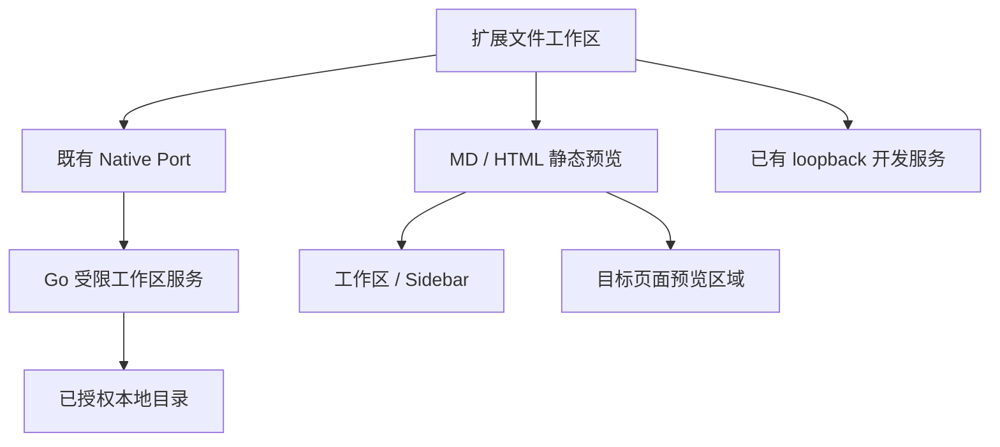

# WebCodex 本地文件工作区 Demo R1

日期：2026-10-10。对应 Browser `main` 与 OpenDesk Go `master`。

后续增量：[R2 当前 ChatGPT 对话编辑 Demo](webcodex-chat-edit-r2.zh-CN.md) 已增加结构化文件上下文、用户触发的回答提案读取、对照审阅和保存回执。下文保留 R1 的历史范围与证据；R2 的回答读取仍不等于模型 MCP 工具调用。当前优先完成 macOS + 已有 OpenDesk Go 的真实验收，执行任务见 R2。

## 结论与交付范围

Native Messaging 可以承载浏览器扩展与本机文件服务之间的通信。现有 OpenDesk 已有 Native Host 安装、配对、消息通道、Browser Core、Sidebar 与页面预览基础；原来的本地脚本 Provider 只读 `.js/.mjs`，并不等于通用文件编辑器。本轮在同一 Native Port 上增加受限工作区文件能力，并提供一个完整的编辑/静态预览界面。

这一版可以由扩展读取和保存用户授权的本机目录。它没有把文件工具注册进 ChatGPT 模型，也没有实现自动读取聊天输出或自动执行 AI 生成代码。对话中的 AI 内容可以由用户复制到编辑器，明确保存后由 Native Host 写回。本机目录授权与官方模型工具接入是两个独立环节。

## 立即查看界面 Demo

打开仓库内的 [webcodex-workspace-demo.html](../../../examples/ui/webcodex-workspace-demo.html)。它是一个独立 HTML，使用正式工作区 UI、预览模块和明确标识的内存后端，不需要安装扩展。

可交互内容包括文件列表、Markdown/HTML 预览、源码编辑、对照显示、保存后读回和另存为。顶部始终提示“交互演示”；刷新页面会重置文件。侧栏和目标网页操作在此模式禁用，不能由此推断本机 Native 已连接。`app/page.tsx` 只是可编辑的源码样本，不是已经启动的 Next.js 项目。

修改正式 UI 后，在 Browser 仓库根目录重新生成演示文件及示例工作目录：

```bash
node scripts/build-workspace-demo.mjs
```

## 使用真实本地文件

前提：本机 OpenDesk 已升级到包含本轮文件能力的版本，并完成既有 Native Host 安装与配对。相关安装流程见 OpenDesk 仓库的 [Native Host 文档](https://github.com/shopable-ai/opendesk/blob/master/docs/integrations/browser/native-messaging-host.zh-CN.md)。仅更新扩展不能让旧 Host 自动支持文件接口；界面会明确提示需要更新 OpenDesk。

1. 从 Browser 仓库根目录执行 `node scripts/build.mjs production`；在 Chrome 扩展管理页加载 `dist/production`。已有开发环境可沿用本项目原有加载流程。
2. 从同一仓库根目录，在本机终端授权演示目录：

   ```bash
   opendesk browser workspace add --path "$PWD/examples/local-workspace" --access read-write
   ```

3. 打开扩展的“本机连接设置”，完成连接，点击其中的“本地文件工作区”入口，再点击“刷新连接”。目录授权可以复用，正常读写无需重复授权。
4. 打开 `README.md`，切换“源码”或“对照”，编辑后点击“保存”。只有写入回执与实际读回的内容/hash 都一致时，界面才显示保存成功。
5. 打开 `index.html` 查看静态 HTML。选择当前 ChatGPT 等网页后，可点击“在侧栏打开”，或“显示到目标网页”。后者只传入当前静态预览，不传递文件 RPC、绝对目录或 Native credential。

只读目录请使用 `--access read-only`；写入权限不会默认授予。列出或撤销授权使用：

```bash
opendesk browser workspace list
opendesk browser workspace revoke --workspace-id <上一步实际返回的工作区ID>
```

目录授权目前通过本机 CLI 完成；原生文件夹选择器尚未实现。工作区主界面可以独立打开或作为指定标签页的 Sidebar；“返回工作台”会恢复该标签页的原有侧栏页面。

## Markdown、HTML 与 Next.js 的不同处理

| 内容 | 本轮处理 |
| --- | --- |
| Markdown | 基础标题、段落、列表、引用、代码块、表格及强调；原始 HTML 转义。不宣称完整 CommonMark/GFM/MDX 支持 |
| HTML | inert template 解析、元素/属性白名单，再放入空 `sandbox` iframe；禁止脚本、事件、表单提交及外部资源加载 |
| JS、TS、TSX 等 | 按 UTF-8 文本编辑，静态预览显示源码，不执行代码 |
| Next.js/Vite 本机应用 | 在“本机应用”输入已经启动的 `http://127.0.0.1:端口/` 或 `http://localhost:端口/`，由实际本机服务渲染 |

Next.js 示例：在用户自己的、已经安装依赖且配置了 `dev` script 的项目根目录运行 `npm run dev -- --hostname 127.0.0.1 --port 3000`，然后在工作区连接该 URL。Demo 不安装依赖、不启动子进程、不解释 TSX。若应用设置了禁止嵌入的响应头，使用“独立打开”。Next.js 服务、HMR、应用响应头与真实嵌入效果本轮尚未在浏览器验收。

静态预览 iframe 的 CSP 为：

```text
default-src 'none'; script-src 'none'; style-src 'unsafe-inline'; img-src data:;
connect-src 'none'; frame-src 'none'; object-src 'none'; base-uri 'none'; form-action 'none'
```

本机应用 iframe 与静态预览独立，允许应用脚本但不具有扩展文件桥。工作区宿主额外限制 `frame-src` 为自身和两个 loopback origin；初始 URL 不接受远程地址、凭据或缺少端口的地址，也不支持 IPv6。网页预览绑定选中的精确 `documentId`，导航后必须重新选择，关闭或 pagehide 会释放预览。

## 实现结构



`src/native-agent/file-workspace-service.js` 是既有 Native Port 上的协议适配层。只有精确的 `native-agent/workspace.html` 扩展顶层文档可通过 runtime 调用它；普通网页、内容脚本、USER_SCRIPT、现有页面 SDK 和预览 frame 无此入口。

Host 与 Browser 双向协商 `localFilesVersion:1` 后启用 `opendesk.local-files.v1`。六个方法为 `files.status`、`workspaces.list`、`files.list`、`files.read`、`files.write`、`files.create`。Host 每个连接生成新 session；扩展冻结输入和连接身份、重查权限，写请求不自动重试。现有十个 Browser RPC、Node 构建/MCP 设施及 R16 只读规划通道的权限边界不变。

原生实现与完整协议见 OpenDesk 仓库的 [本地文件 Demo 文档](https://github.com/shopable-ai/opendesk/blob/master/docs/integrations/browser/webcodex-local-files-demo-r1.zh-CN.md)。

## 保存语义与限制

每个文本最多 32 KiB，整个 Native JSON 帧最多 60 KiB；大量转义字符可能先触达帧预算。只操作明确授权目录中的支持文件类型，不允许隐藏目录、`node_modules`、父级穿越、绝对路径、符号链接或硬链接。没有删除、目录创建、监听或多文件事务。

覆盖保存必须带读取时的 SHA-256。Host 写入同目录临时文件、检查冲突、原子替换、读回并同步目录；新文件独占创建，不覆盖已有路径。服务内与跨 Native 连接有互斥，但这不是对任意外部编辑器的严格 OS compare-and-swap；最后检查到 rename 的竞争窗口在原生文档中明确说明。

外部修改冲突会保留草稿并显示磁盘版本。断连、超时或无法核对的回执会标记结果未知，禁止自动重复保存；需要读回核实。创建回执与内容读回成功后，即使目录刷新失败，也保留正确的“文件已创建”状态，并只提示刷新目录。

## ChatGPT 模型自动调用的正式接法

Native Messaging 负责扩展到本机的通信；MCP 负责向模型描述并提供工具。要让 ChatGPT 对话主动调用本地文件工具，需要给同一个受限文件服务增加 MCP adapter，并在 ChatGPT 中配置该工具连接。

截至本次查阅，OpenAI 已有 **Secure MCP Tunnel**，支持从私有环境向外建立连接，并在 ChatGPT 自定义 MCP 插件中选择 Tunnel；不必为此把文件服务作为公开无认证 HTTP 接口。Tunnel 的工作区关联、Tunnels Read + Use 等权限及认证仍需满足。本轮没有实现这个 adapter、配置 tunnel 或验证真实 ChatGPT 模型工具调用，也不读取或复用浏览器中的模型登录凭据。

## 验证状态

组件测试与构建通过不等于真实 Chrome UI 验收。详细结果记录于 [本轮工作流记录](../../framework/workstreams/webcodex-workspace-r1.md)。

- Browser 最终集成验证 71 项组件测试通过：文件服务及相邻 Native Bridge 45 项、包合同 4 项、上游 R16 Native AI 运输 22 项。覆盖旧 Host 兼容、错误回执、冲突、输入冻结、断连后禁止重放、受信任入口及各子协议共存。
- Go 文件与相邻 Native 功能 20 项定向 race 测试通过，使用真实临时文件和 Native frame；`go vet` 通过。Darwin arm64 仅交叉编译，未运行。
- Browser 生产构建与原有包校验通过，没有放宽体积预算、manifest CSP 或普通页面权限。
- 当前执行环境拒绝 Unix Socket 创建，Chrome 在创建 process singleton socket 时退出；提权申请也被自动审批策略拒绝。没有绕过此限制，因此实际 Chrome 加载、Sidebar 用户手势、页内预览、CSP 网络阻断、Next HMR 与用户 macOS 安装均未验收。
- 完整 OpenDesk 桌面构建受既有离线依赖缺失阻塞；测试目录审计的 24 个失败均为原有未登记测试，本轮新增的两个 Go 测试文件已登记。

## 官方依据

- [Chrome Native Messaging](https://developer.chrome.com/docs/extensions/develop/concepts/native-messaging)：本机 Host 安装、扩展身份与 stdio 帧。
- [Chrome Side Panel API](https://developer.chrome.com/docs/extensions/reference/api/sidePanel)：侧栏配置和由用户操作触发的打开流程。
- [Chrome 扩展 CSP](https://developer.chrome.com/docs/extensions/reference/manifest/content-security-policy)：扩展执行与嵌入边界。
- [OpenAI Secure MCP Tunnel](https://developers.openai.com/api/docs/guides/secure-mcp-tunnels)：私有 MCP 与 ChatGPT Tunnel 连接。
- [Next.js CLI](https://nextjs.org/docs/app/api-reference/cli/next)：真实开发服务与 hostname/port 参数。
