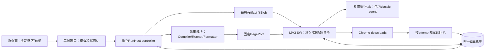
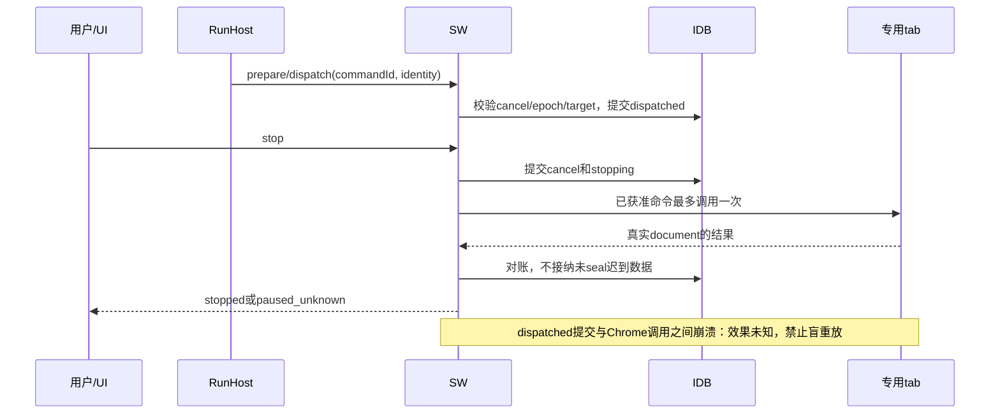
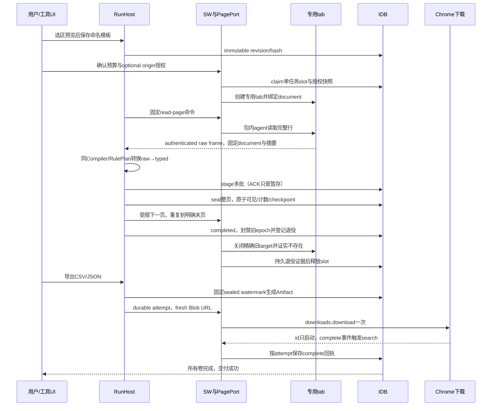

# OpenDesk Browser：产品与框架方案

建议构建一个独立的Chrome MV3扩展，使用原生manifest、ESM JavaScript源码和webpack 5/terser构建，保留当前可用HTML/JS选区与工具窗口。WXT是可替换构建候选，本轮不用它推动UI重写。用户电脑的产品运行时只有Chrome；Node只开发/构建/测试，Playwright只用于验证。此推荐是阶段01设计决定，真实包和浏览器行为由02A/02B/03/04验证。

## 用户流程与首版边界

目标用户是需要反复从有权访问的网页列表取数的运营、研究和数据处理人员，先支持可用DOM选择的列表与表格。收费假设是免费用户验证单页100行/1模板，Pro购买更大预算与多模板；是否愿意付费、签发运营和商店政策仍需M12独立验证，本轮没有真实支付或已证明的商业模式。

用户在原页面主动打开工具窗口，选列表、字段和分页，预览前10行；命名并保存完整不可变模板。再次运行时选择模板、确认有效预算、申请该origin权限，扩展新建专用执行tab。RunHost采集并显示整页已确认数量，用户可停止；自然结束才“完成”，停止/达到上限/中断/未知都明确显示。用户从已确认页面选择CSV或JSON导出，浏览器complete回执之后才显示下载完成。工具窗口关闭会中断，重新打开可查看旧结果并显式重新运行/导出。

首版支持顶层DOM、单HTTP(S) origin、单页/同源next-link/已确认简单next-button、每profile一个任务/工具窗口/执行tab。保留登录profile但不读取复制cookie。source原页面只选区/预览，不翻页；正式任务固定tab/frame/document，不能跟随当前活动tab。详情页、iframe、跨origin流程、后台续跑、任意代码/DSL、脚本市场、App/Android/HID与本机host不进入首版。

原UI保留表格/列表选区、定位、字段设置、预览和窗口复用布局；增量增加模板列表/保存revision、预算/权限说明、停止与未知状态、已确认页数和下载回执。框架选择服务这些有效行为，不把迁框架当产品目标。来源快照与source-audit记录哪些行为保留、哪些需要修正；旧Code页与动态字符串执行不进入新包。

## 运行架构

RunHost独立controller拥有唯一采集loop，UI只观察投影与发请求。SW不等整轮结果，只协调短命令、真实sender、目标、权限、退役和下载。SW重启从IDB和journal恢复对账，不能重复启动loop。单连接/迁移/事务由底座维护，领域模块只通过公开接口；不再建broker/owner/ChromePage/DB连接。

另一个关键顺序是stage→seal：前2批ACK只暂存，整页第3批失败则该页0条可见；seal与stop按IDB提交先后决定整页是否计入。用户看到的count/export/checkpoint始终来自sealed页面。同一模板两次run数据独立，0/false/空串/null和150字原文保留，无title不过滤。

## 故障与恢复

停止先提交则命令不派发；派发先提交则允许既定动作在停止后发生。无法证明外部效果时paused_unknown保持占用名额。显式放弃先封禁旧epoch、abort未seal页，关闭精确执行tab并证实不存在，再释放名额。仅超时、仅窗口存在或仅关闭host都不能证明可接管。新run从起始页开始，不承诺旧页续跑。

下载ID只代表启动；complete才是浏览器完成。提交/保存ID有gap时按唯一Blob URL、扩展身份和时间对账，0/多个候选不能自动重下。10分钟下载deadline后的迟到complete可以解析原attempt的unknown，但保留超时历史；再次导出产生新job/attempt/URL，旧回执不能完成新job。扩展只核下载前Artifact hash，diskHashVerified=false。

## 工程、权限和AI边界

拟定目录与关键分工见task-breakdown.json。02A建立空业务工程/manifest/构建/窗口/静态注入槽，02B唯一实现公共RunHost、SW/PagePort、IDB、下载与Entitlement；03填固定src/features/scraping模块槽并迁入有效UI；04在前序交接后验收一个真实扩展。来源三仓库只读，启动实现前复核dirty/hash及固定快照差异。

初始拟定权限storage/scripting/activeTab/downloads，执行origin使用可选host权限，逐操作复核；不照搬proxy/cookies/history/webRequest。sender来自实际扩展page和固定agent，检查URL/id/document；包内classic agent不接受远程JS、eval、new Function或字符串fallback。模板是受限数据，未知字段/能力/危险键拒绝。

AI不处于首版执行关键路径，不采集页面内容或token发给云端，不生成可执行浏览器脚本，不代替selector/模板校验、支付/许可判断或产品验收。将来若加AI辅助字段建议，需要另立用户数据授权与本地验证边界；当前不增加AI SDK、服务或真实收费接口。

免费与Pro预算、离线/到期/撤销/签名边界已写入semantics，运行前展示effectiveLimits；既有结果不因许可证到期被扣留。没有真实签发/收费/商业证据，不宣称可收费上线。

## 可人工评审的完成条件

阶段01交付的是完整设计与验收输入：合同、状态表、三类迁移向量、关键工作包、M01–M11测试映射和复现方法，并由独立review闭合设计阻断。02A/02B/03/04交付真实实现和新证据。当前无生产功能/真实Chrome产品测试通过；M12需求和付费试点独立pending。所有下游阻断、残余验证与实际文件hash均在handoff中明示。

## 正常执行时序与UI位置

工具窗口上方保留选区/字段/预览操作；左侧新增模板列表与命名/编辑新revision；主区是字段列序和前10行预览，底部运行区显示已seal页/记录、预算和stop。结果页区分completed/limit_reached/stopped/interrupted/paused_unknown，下载区按每次导出与每卷显示启动、完成、失败或待核对。未知任务出现显式放弃按钮及“将关闭专用执行页，保留已确认记录”说明。重开窗口从持久投影恢复展示，不能把按钮状态当事实。

已选择与待验证详见framework-decision；未来桌面OpenDesk只保留版本化PagePort/Artifact必要适配边界，本轮没有native host、第二底座或桌面生产功能。

旧代码复用以source-audit/source-behaviors的当前加载入口与行为事实为起点，并合并第⑤阶段CodeGraph关系图。函数同名、TS来源注释或receipt自洽不代表当前调用链等价；按实际hash、动态消息/注入边、行为fixture和影响测试确认迁入边界。⑤交付未合并前阶段01不ready。

用户已把基础环境与关键代码迁移拆为可独立验收任务：02A先交付真实可加载空业务工程，02B再迁入公共能力和可靠底座，03保留选区UI与领域采集产品。环境通过不能证明旧代码复用或完整产品通过。

浏览器重启或扩展重载后，若旧执行页无法通过唯一包内创建凭据重新识别，首版保持未知任务与名额冻结，禁止根据旧数字tabId自动关页或接管；已确认结果仍可导出。此自动恢复限制属于明确首版边界，需要02B/04实测。⑥是并行开发浏览器支持，以02A/02B/03实际构建触发各自冒烟，使用独立profile或锁，④保留最终全面验收责任。

## 经⑤最终审计确认的复用边界

已逐项核17个⑤交付hash、54项复用映射的232处捕获来源引用和29条浏览器边。4个缺捕获实现（CrawlProfileCore、ConfigExecutor、AI服务/助手controller）不补造；静态同名误边不作为运行证据。5条未闭合旧边通过“替换为已定义有限接口/首版排除”作设计选择，不假称已查到旧实现。20:09:49UTC复核25个captured路径已不同于overlay；冻结baseline/显式delta，不追随其他任务覆盖来源。02B/03如需采用更晚代码必须记录diff/hash/影响测试。

| 旧代码 | 首版迁入方式 | owner与关键断言 |
|---|---|---|
| ListSelector/uiManager/ListDetector | 保留选区交互，取消后自有资源清理和迟到operation隔离；classic静态入口 | 03业务，02A静态槽，02B权限桥；重复init/cancel0遗留 |
| TableDataExtractor及跨行href/src集合 | 抽取字段读法，修复跨行相同href/src被误删、无header首行丢失 | 03；0/false/null/长文本/无title/重复链接行保留 |
| Rule/Request/Item/Pipeline | 选择性纯算法，通过有限RulePlan/严格类型和固定顺序实现 | 03；禁止用户函数/回调字符串，复跑隔离 |
| ChromePage/长任务SW/共享tab | 不整包迁；固定ISOLATED PagePort、独立RunHost、真实document围栏 | 02B；activeTab变化不改变目标，stop-first0新调用 |
| ExportManager/FeedExport/旧anchor下载 | 纯formatter适配；sealed游标/8MiB卷/Artifact+attempt回执替换交付部分 | 03格式、02B下载；ID仅启动，late不完成新job |
| todo浏览器资源清理与完成包络 | 仅借用可验证生命周期意图；remoteJS/HID/账户/Android等排除 | 02B；明确dispose与错误，非可信动态桥不能准入 |

具体symbol/实际hash/候选路径/owner/回归与影响选择在reuse-decision.json/md。EXT-R01窗口壳归02A，handoff后02B增加host管理；原UI布局由03填既有模块面板，公共tool.html修改需02B集成，避免两个UI或共同文件并发作者。新增Stop是可见产品按钮，不能用旧globalcontrols对象代替用户可用性证明。
