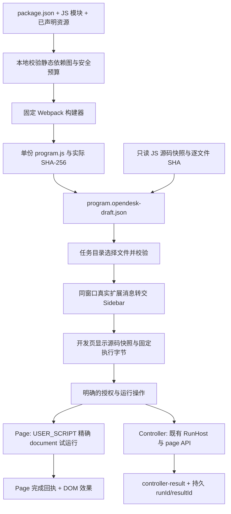

# Sidebar 多文件 Demo：目录、选择与运行原理 R2

本指南对应 2026-10-09 已合入 main 的实现。真实 Chrome 验收仍开放；“适合展示”表示示例内容较完整，不表示已经取得原生 PASS。后续执行提示词见 [多文件自动导入与运行 R2](prompts/goal-sidebar-multifile-auto-import-demo-r2.md)，已有结果和复用条件见[工作流续测入口](workstreams/sidebar-multifile-native-r1-20261009.md#resume)。

## 目录与示例选择

仓库内源码根目录为 `examples/programs/`，标准网页为 `examples/tasks/demo-form.html`。本任务的实际最新 checkout 是 `/Users/shopme/.codex/worktrees/sidebar-multifile-native-r1/opendesk-browser`；主工作区 `/Users/shopme/Documents/workspace/opendesk-browser` 保留旧 main 和未提交修改，在本次核对时还没有下面四个 Demo 目录。不要为展示示例覆盖主工作区，先使用独立 checkout，并核对最新 main。

| 示例目录 | 包含内容 | 推荐用途 | 当前证明与缺口 |
| --- | --- | --- | --- |
| [page-ui-basic](../../examples/programs/page-ui-basic/README.md) | `src/main.js`、`title.js`、`view.js`，加 CSS、JSON、PNG | **主展示 Demo**：右上方面板、输入与状态、读取本页信息、关闭/重新打开/完全退出；覆盖多模块与真实资源效果 | 现有 UI helper 组件证据可复用；本工作流没有归档它的最终构建身份或 Chrome 完整运行结果，先查其他工作流，再补缺失构建/原生证据 |
| [sidebar-page-demo](../../examples/programs/sidebar-page-demo/README.md) | `src/main.js`、`fixture.js`、`proof.js` | **首个正确性基准**：导入三个 JS 源码、运行后出现唯一 DOM 标记，便于定位导入/编译/执行问题 | 已有构建、哈希和组件 PASS；最终包的原生导入/执行尚未完成 |
| [sidebar-controller-demo](../../examples/programs/sidebar-controller-demo/README.md) | `src/main.js`、`params.js`、`search.js` | **Controller 基准**：参数 `{"keyword":"OpenDesk"}`，真实填写/搜索、读取结果、持久运行身份 | 已有构建、哈希和组件 PASS；真实 runId/resultId、重复执行与生命周期待测 |
| [sidebar-assets-contract](../../examples/programs/sidebar-assets-contract/README.md) | 一个 JS 模块加 CSS、JSON、PNG | **资源契约探针**：检查传入 `main({assets})` 的资源记录 | 入口只返回 cssBytes/jsonName/imageUrlReady，源码不渲染 CSS 或 PNG；不能用这个返回值证明视觉资源效果 |

`page-heading` / `controller-title` 是通用 API 示例，目标为 `https://example.com`；本轮手工验收统一使用前三个示例和标准本地网页，不切换到这些旧入口。

“高质量”在这里指入口清楚、职责单一、输出可观察、源码/资源身份可核对、重复运行与清理有具体条件。建议以 **Page 基准 → Controller 基准 → Page UI 展示** 为验收顺序，展示时重点看 Page UI；不要把界面丰富等同于证据更充分。

## 多文件是怎样导入并运行的

1. **本地项目是开发输入。** `package.json.opendesk` 定义 id、version、入口和运行类型；ESM 的 `import './helper.js'` 决定模块图。校验器检查受限路径、依赖、编码、预算和资源类型，不执行项目自带 scripts 或 Webpack 插件。
2. **构建器将多模块变成一份执行代码。** 固定 Webpack 合并模块，适配项目的 default export 为既有 `async function main()`。Page 资源作为固定 CSS/JSON 文本和图片 data URL 内嵌；Controller 适配既有 `{page,params,...}` 上下文。Chrome 执行这份产物，不到磁盘上逐个读取原始模块。
3. **一个 JSON 自动带入多个 JS 源码快照。** `program.opendesk-draft.json` 的 `format` 为 `opendesk.program-draft.v1`，包含 `project`、`runtimeKind`、`build`、`sourceUtf8` 和 `authoring.files`。`sourceUtf8` 是固定编译代码，`authoring.files` 是便于查看的源码快照；导入时核对两类字节的哈希。当前只读列表只含 JS，CSS/JSON/PNG 不在独立源码列表中。
4. **导入只交付草稿。** 完整任务目录校验文件后，通过 `opendesk.sidebar.draft-import.v1` 发送给同窗口 Sidebar；接收端核对扩展 sender、目录页面 URL 和窗口身份，Sidebar 再校验草稿。切换源码列表只改变展示，`programSource.source()` 仍返回固定编译代码。导入不保存、不授权、不自动执行，也不等于 Installed。
5. **运行类型决定入口。** Page 在“网页用户脚本 · 依赖与试运行”入口，核对授权和当前 document 后使用既有 `userScripts.execute` 在 USER_SCRIPT 世界试运行；该预览回执明确为 `durable:false`、`registered:false`。Controller 从底栏“运行草稿”进入既有 RunHost，使用 OpenDesk `page` API，保存运行和结果身份。两者不能互换入口。

这里的“自动导入多文件”指：一次导入构建后的 JSON，自动恢复多个源码快照及对应执行代码；Chrome 自动化可以通过已有真实 UI 完成选择文件和运行。**直接选择原始目录并在浏览器内自动 npm/ESM 编译目前未实现。** 后者是另一个产品目标，需要文件读取、构建能力与受控权限合同，不能用现有 JSON 导入成功来代替。

## 怎样判断运行是正确的

哈希只证明“相同字节”，不证明程序逻辑正确。至少核对下面四层。

| 层 | 必须核对的关键信息 |
| --- | --- |
| 项目与产物 | 最新 main/实际 dirty inputs、项目 id/version/runtimeKind/entry、构建模式、真实 outputDirectory；实际 program.js SHA 等于 artifact.sourceHash 和 draft.build.sourceHash，字节数一致 |
| 导入与展示 | 草稿文件 SHA、逐 JS 文件 path/text/SHA；UI 为只读，三个 JS 文件都可切换；运行 sourceHash 仍绑定导入的编译代码，不因查看 helper 文件而改变；同窗口交付，无隐式执行 |
| 行为 | 标准网页、真实操作及页面/面板实际变化；重复运行与非目标页检查；图片实际解码/显示、CSS 实际效果、JSON 实际用于文案；不能只看“导入成功”或 imageUrlReady |
| 回执与生命周期 | 真实 sender/target/document、加载包指纹、Page 回执；Controller 的精确 controller-result、runId/resultId 和结果自身 revision/sourceHash；停止、撤权、导航、关闭、重启后的授权与清理结果 |

三个已有冻结产物的历史身份如下；这些是本地构建证明，不能当作未执行的原生回执。代码或构建模式变化后应产生新身份。

| 项目 | 最终 program.js SHA-256 | JS / draft 字节 |
| --- | --- | --- |
| `sample.sidebar-page-demo` | `4d8693b967e4e5e8b2cc1b67ca52e4dc0cde21fa08a145ade0da8364af0c859b` | 1582 / 3955 |
| `sample.sidebar-controller-demo` | `d7210dd03e38dd9ded917e816289e2adf9b55e0c409a4f72c644091c8f0684c8` | 1194 / 3134 |
| `sample.sidebar-assets-contract` | `a88d116a40d75fc1b11803db7c73f53d38ea3c0705f3e7cdd7949d7334fc2619` | 1607 / 2665 |

实际输出目录见[已归档 final-programs.json](evidence/sidebar-multifile-native-r1-20261009/current-main/final-programs.json)，通用形态为 `artifacts/programs/<id>/<version>/r31-<mode>/<程序哈希前缀>-<开发输入前缀>/`。需要导入的是里面的 `program.opendesk-draft.json`，不是 package.json、单个 helper.js 或 `program.opendesk-task.json`。Controller 的 task JSON 是另一条 Candidate 路径。

具体行为条件：

- Page 基准：标准页 `#lab-text` 内有一个 `#opendesk-multifile-page-proof`；再次运行仍只有一个。非目标路径的代码应返回 `SKIPPED_OUT_OF_SCOPE`，不写入。
- Controller 基准：`#results` 显示“结果：OpenDesk”，`#search-count` 相对运行前只增加 1；再次运行仍只增加 1，分别有真实持久运行身份。
- Page UI：图片/JSON 文案/样式正确，空输入报错；有效输入后返回页面标题与输入。只统计 `data-od-id` 为 `sample.page-ui-basic.panel` 或 `sample.page-ui-basic.launcher` 的 host：打开 2，关面板 1，重新打开 2，完全退出 0；重复试运行不遗留同 id 的旧监听器。其他工具的 host 不计入本示例。
- Page UI 的 `main()` 返回 `UI_OPEN` 后，按钮/定时器仍由 UI owner 持有；返回成功不等于 UI 已清理。关闭、完全退出、导航/pagehide、重复运行分别核验。

## 难点与当前安全边界

- **源码展示和执行字节要分开。** 查看辅助模块不能让执行器误跑辅助模块；本地修改需要重新构建、重新导入。开发 Source Map 可辅助定位，但只在存在实际映射时归因源码行号。
- **异步导入与权限手势不能混淆。** crypto 校验、跨窗口转交需要等待真实完成；浏览器授权/运行仍由可信输入触发，不能用 synthetic events 或 DOM 赋值完成验收。
- **目标 document 与结果必须持续一致。** 选中标签页后导航、关闭、撤权或重启会使旧目标/owner 失效；缺回执或未知 effect 保守拦截，不能为截图盲目再点运行。
- **资源和长寿命 UI 需要真实环境证明。** Shadow DOM/CSP、图片解码、data URL、事件和 timer 清理不能靠 Node DOM double 证明。Page 资源最多 32 项，CSS/JSON/图片为 24/16/32 KiB，合计 60 KiB；最终 Page JS ≤100000 字节，draft 文件 ≤512000 字节；Controller 资源仍为 `E_PROJECT_ASSET_ENV`。不新增运行时远程加载权限。
- **原生环境与产品缺陷分开定位。** 上次 Mac 锁定阻断文件选择器；历史观察器 label/重启时序修正尚未实测。本地 Native CLI 握手与 macOS CI 裸 Chrome/CDP 失败是另外两条路径，Native Host 不可用不应阻断手动 Sidebar。先做发生变化的窄核验，不重跑同一失败。

实现追溯：[项目校验器](../../scripts/validate-program-project.mjs)、[构建器](../../scripts/build-program-project.mjs)、[任务目录导入](../../src/ui/task-workbench.js)、[同窗口消息接收](../../src/ui/tool-shell.js)、[源码快照与固定执行源](../../src/ui/program-source.js)、[Page 试运行](../../src/scripting/user-scripts/preview.js)、[Controller 草稿入口](../../src/ui/script-editor.js)、[UI owner 与清理](../../src/scripting/user-scripts/page-ui.js)。
